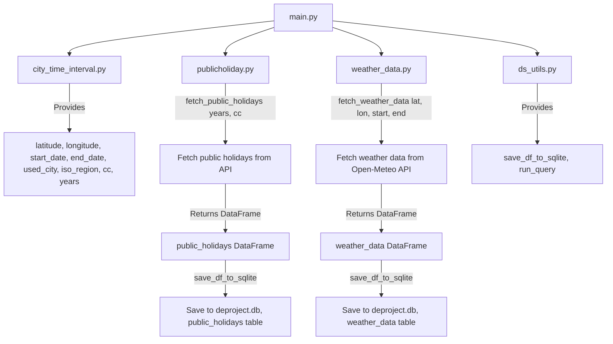

```mermaid
flowchart TD
    A[main.py] --> B[city_time_interval.py]
    A --> C[publicholiday.py]
    A --> D[weather_data.py]
    A --> E[ds_utils.py]

    B -->|Provides| F[latitude, longitude, start_date, end_date, used_city, iso_region, cc, years]

    C -->|fetch_public_holidays years, cc| G[Fetch public holidays from API]
    G -->|Returns DataFrame| H[public_holidays DataFrame]
    H -->|save_df_to_sqlite| I[Save to deproject.db, public_holidays table]

    D -->|fetch_weather_data lat, lon, start, end| J[Fetch weather data from Open-Meteo API]
    J -->|Returns DataFrame| K[weather_data DataFrame]
    K -->|save_df_to_sqlite| L[Save to deproject.db, weather_data table]

    E -->|Provides| M[save_df_to_sqlite, run_query]
```
